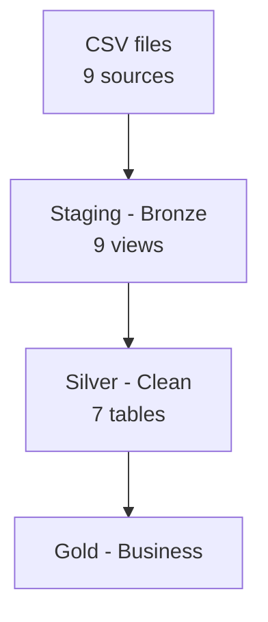

# Olist E-Commerce dbt Pipeline

## Overview
End-to-end ELT pipeline transforming raw Brazilian e-commerce data 
from Olist through Bronze → Silver → Gold layers using dbt and DuckDB.
Built to demonstrate modern analytics engineering practices including medallion architecture, data quality testing, backup recovery strategy, and business-ready analytical models.

## Architecture
- **Staging (Bronze):** 9 models — raw source tables declared and lightly cleaned, built as views
- **Silver:** 7 models — cleaned, deduplicated, validated and enriched business models, built as tables
- **Gold:** 4 models — final business-ready analytical models for reporting and analysis

## Architecture Diagram

## Dataset
[Brazilian E-Commerce Public Dataset by Olist](https://www.kaggle.com/datasets/olistbr/brazilian-ecommerce)
- 99,441 orders from 2016 to 2018
- 9 source tables covering orders, customers, products, sellers, reviews, payments and geolocation

## Tech Stack
- **dbt Core 1.12** — transformation, testing and auto-generated documentation
- **DuckDB** — local analytical database
- **Python** — data ingestion from CSV sources
- **Git + GitHub** — version control and portfolio

## Project Structure
models/
- staging: → 9 views, one per source table
    - sources.yml
    - stg_*.sql
- silver: → 7 cleaned and validated tables
    - schema.yml
    - *_clean.sql
- gold: → 4 business ready analytical tables
    - schema.yml
    - *.sql
tests/ → custom data quality tests

## Staging Layer (Bronze)

| Model | Source Table |
|-------|-------------|
| stg_orders | olist_orders_dataset |
| stg_customers | olist_customers_dataset |
| stg_order_items | olist_order_items_dataset |
| stg_products | olist_products_dataset |
| stg_product_translation | product_category_name_translation |
| stg_sellers | olist_sellers_dataset |
| stg_order_payments | olist_order_payments_dataset |
| stg_order_reviews | olist_order_reviews_dataset |
| stg_geolocation | olist_geolocation_dataset |

## Silver Layer Models

| Model | Source | Key Transformations |
|-------|--------|---------------------|
| orders_clean | stg_orders | Delivery metrics, fiscal year, date validation |
| customers_clean | stg_customers | City standardisation, repeat customer flag |
| order_items_clean | stg_order_items | Deduplication, price categories, freight analysis |
| products_clean | stg_products + translation | English category names, volume calculation |
| order_payments_clean | stg_order_payments | Payment type standardisation, installment categories |
| sellers_clean | stg_sellers | Column renaming, city normalisation |
| order_reviews_clean | stg_order_reviews | Sentiment analysis, response time, deduplication |

## Gold Layer

| Model | Grain | Business Questions Answered |
|-------|-------|---------------------------|
| olist_master_table | order_id + product_id | Wide table joining all entities — base for ad hoc analysis |
| sales_performance | product_category + fiscal_year + month | Revenue by category, freight analysis, monthly trends |
| customer_behaviour | customer_unique_id | Total spend, order count, preferred payment, avg review score |
| delivery_performance | seller_id | On time rate, late rate, avg delivery days, avg review score per seller |

## Data Quality
- **112 tests** across all layers — all passing
- Source empty checks on all 9 raw tables
- Custom singular tests for business logic validation:
    - assert_no_future_order_dates — no order_date beyond today
    - assert_delivery_after_purchase — delivered_at >= purchased_at
    - assert_positive_payment_value — all payment_value > 0
    - assert_valid_review_score_range — review_score between 1 and 5
    - assert_no_orphan_order_items — every item maps to a valid order
- Pre-hook backup on every silver and gold model for point-in-time recovery
- NULLIF protection on all division calculations
- Deduplication logic on order_items and order_reviews

## Key Engineering Decisions
- **Item grain for master table** — enables COUNT(DISTINCT order_id) for order metrics while allowing product level slicing without string splitting
- **ROW_NUMBER for payment deduplication** — robust against payment_sequential not starting at 1 (found in source data across 80 orders)
- **Pre-hook backup pattern** — before each silver/gold rebuild, the current table is dumped to {{ this.name }}_backup. Enables instant rollback if a downstream model breaks or if business logic needs reverting.
- **LEFT JOIN in master table** — preserves cancelled orders with null item columns rather than losing business context
- **Invalid date filtering** — 1,382 orders with date sequence violations excluded from gold layer
- **Explicit tie-breaking on payment preference** — when a customer uses two payment types equally, tie is broken alphabetically for deterministic results

## Skills Demostrated
- **dbt**: models, sources, tests, docs, pre-hooks, materializations, refs
- **SQL**: window functions, CTEs, conditional aggregation, NULLIF safety, DISTINCT-aware joins
- **Data Modeling**: medallion architecture, grain selection, dimensional design
- **Data Quality**: source freshness, accepted_values, relationships, custom singular tests
- **Analytics Engineering**: DRY principles, layered dependencies, YAML documentation, schema contracts

## How to Run
1. Install dependencies: `pip install dbt-duckdb`
2. Download Olist dataset from [Kaggle](https://www.kaggle.com/datasets/olistbr/brazilian-ecommerce) and place CSVs in `raw_data/`
3. Load source data: `python load_data.py`
4. Run full pipeline: `dbt build`
5. Run tests only: `dbt test`
6. View documentation: `dbt docs generate && dbt docs serve`

## Status
✅ Project Complete

### Completed
- ✅ Staging layer — 9 models
- ✅ Silver layer — 7 models, 92+ tests, pre-hook backups
- ✅ Source validation tests on all 9 raw tables
- ✅ Gold layer — 4 models
  - olist_master_table — wide table at item grain
  - sales_performance — category and time based revenue analysis
  - customer_behaviour — per customer aggregated metrics
  - delivery_performance — per seller delivery KPIs

### Next Steps
- 🔜 Migrate to Snowflake — replace DuckDB adapter
- 🔜 Add dbt Cloud scheduling and alerting
- 🔜 Databricks project — medallion architecture with PySpark and Delta Lake