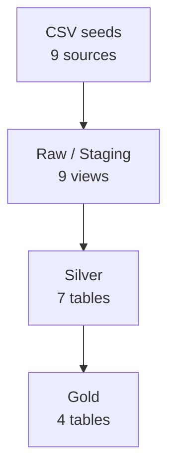
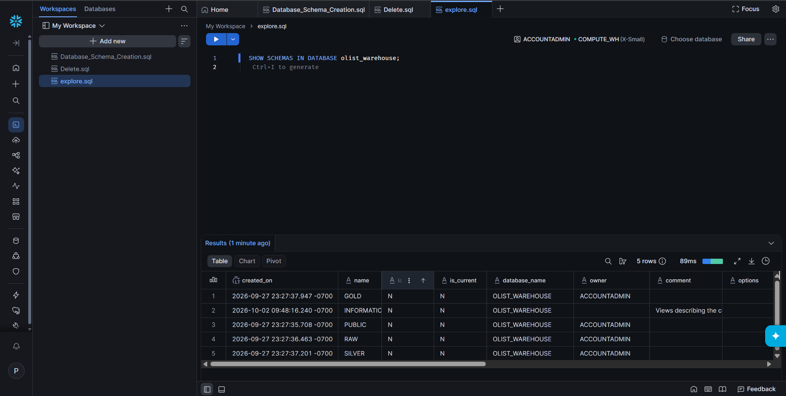
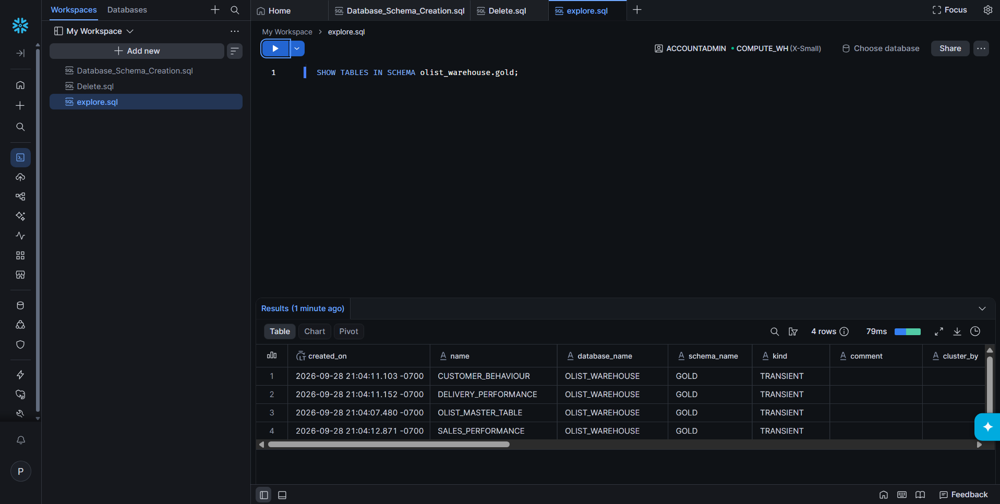
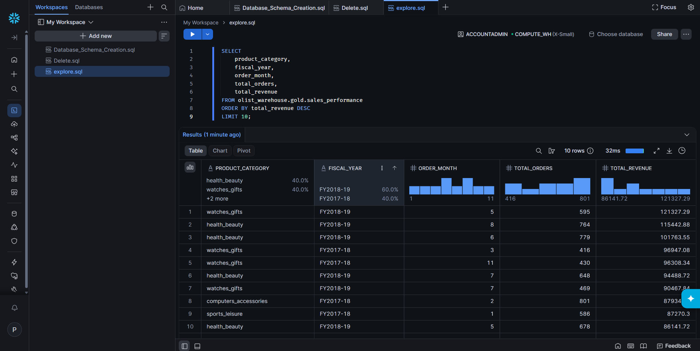

# Olist E-Commerce dbt Pipeline

> ⚠️ This branch (`snowflake-migration`) runs on **Snowflake**.
> For the original **DuckDB** version, see the [`main`](../../tree/main) branch.
> For **Airflow orchestration**, see the [`airflow-orchestration`](../../tree/airflow-orchestration) branch.

## Overview
End-to-end ELT pipeline transforming raw Brazilian e-commerce data 
from Olist through Raw → Silver → Gold layers using dbt and Snowflake.
Built to demonstrate modern analytics engineering practices including medallion architecture, data quality testing, custom schema routing, table backup strategy, and business-ready analytical models. The same pipeline is also ported back to DuckDB on the `main` branch and orchestrated on the `airflow-orchestration` branch.

A production-style ELT pipeline on 100k+ real e-commerce orders — medallion architecture, 92 passing data tests across 121 dbt nodes, and cross-warehouse portability across DuckDB, Snowflake, and Airflow orchestration.

## Architecture
- **RAW / Staging (Bronze):** 9 models — raw source tables declared and lightly cleaned, built as views in `OLIST_WAREHOUSE.RAW`
- **Silver:** 7 models — cleaned, deduplicated, validated and enriched business models, built as tables in `OLIST_WAREHOUSE.SILVER`
- **Gold:** 4 models — final business-ready analytical models for reporting and analysis in `OLIST_WAREHOUSE.GOLD`

## Architecture Diagram

```mermaid
flowchart TD
    A[CSV seeds<br/>9 sources] --> B[Raw / Staging<br/>9 views]
    B --> C[Silver<br/>7 tables]
    C --> D[Gold<br/>4 tables]
```

## Dataset
[Brazilian E-Commerce Public Dataset by Olist](https://www.kaggle.com/datasets/olistbr/brazilian-ecommerce)
- 99,441 orders from 2016 to 2018
- 9 source tables covering orders, customers, products, sellers, reviews, payments and geolocation

## Tech Stack
- **dbt Core 1.12** — transformation, testing and auto-generated documentation
- **Snowflake** — cloud data warehouse (`OLIST_WAREHOUSE`, `COMPUTE_WH` X-Small warehouse)
- **Python** — data ingestion from CSV sources
- **Git + GitHub** — version control and portfolio

## Snowflake Setup
See [`SNOWFLAKE_SETUP.md`](./SNOWFLAKE_SETUP.md) for the full DDL and `profiles.yml` example.

**Schema layout:**
| Schema | Contents | Materialization |
|---|---|---|
| `OLIST_WAREHOUSE.RAW` | Seeds + 9 staging views | view |
| `OLIST_WAREHOUSE.SILVER` | 7 cleaned business tables | table |
| `OLIST_WAREHOUSE.GOLD` | 4 analytical tables | table |

## Project Structure
```
models/
├── staging/          # 9 views, one per source table
│   ├── sources.yml
│   └── stg_*.sql
├── silver/           # 7 cleaned and validated tables
│   ├── schema.yml
│   └── *_clean.sql
└── gold/             # 4 business-ready analytical tables
    ├── schema.yml
    └── *.sql

macros/
├── generate_schema_name.sql    # custom schema routing
└── backup_table.sql            # pre-rebuild table snapshot

tests/                # custom data quality tests
```

## Staging Layer (Raw) Models

| Model | Source Table |
|-------|-------------|
| stg_orders | olist_orders_dataset |
| stg_customers | olist_customers_dataset |
| stg_order_items | olist_order_items_dataset |
| stg_products | olist_products_dataset |
| stg_product_translation | product_category_name_translation |
| stg_sellers | olist_sellers_dataset |
| stg_order_payments | olist_order_payments_dataset |
| stg_order_reviews | olist_order_reviews_dataset |
| stg_geolocation | olist_geolocation_dataset |

## Silver Layer Models

| Model | Source | Key Transformations |
|-------|--------|---------------------|
| orders_clean | stg_orders | Delivery metrics, fiscal year, date validation |
| customers_clean | stg_customers | City standardisation, repeat customer flag |
| order_items_clean | stg_order_items | Deduplication, price categories, freight analysis |
| products_clean | stg_products + translation | English category names, volume calculation |
| order_payments_clean | stg_order_payments | Payment type standardisation, installment categories |
| sellers_clean | stg_sellers | Column renaming, city normalisation |
| order_reviews_clean | stg_order_reviews | Sentiment analysis, response time, deduplication |

## Gold Layer Models

| Model | Grain | Business Questions Answered |
|-------|-------|---------------------------|
| olist_master_table | order_id + product_id | Wide table joining all entities — base for ad hoc analysis |
| sales_performance | product_category + fiscal_year + month | Revenue by category, freight analysis, monthly trends |
| customer_behaviour | customer_unique_id | Total spend, order count, preferred payment, avg review score |
| delivery_performance | seller_id | On time rate, late rate, avg delivery days, avg review score per seller |

## Custom Macros

### 1. `generate_schema_name`
By default dbt concatenates `target.schema` with the custom schema, which produces names like `RAW_SILVER` and `RAW_GOLD`. This macro overrides that behavior so models land exactly in `raw`, `silver`, and `gold`.

```sql

    
    
        {{ default_schema }}
    
        {{ custom_schema_name | trim }}
    

```

### 2. `backup_table`
Before a silver or gold table model rebuilds, this macro creates a `<table>_backup` copy of the current state. Enables instant rollback if a downstream model breaks or if business logic needs reverting.

```sql

  
    
      
        DROP TABLE IF EXISTS {{ this.name }}_backup;
        CREATE TABLE {{ this.name }}_backup AS
        SELECT * FROM {{ this.name }};
      
      
    
  

```

## Data Quality
- **92 data tests** across all layers — all passing
- **121 total dbt nodes** built successfully in a single `dbt build` (9 seeds + 9 staging views + 11 tables + 92 tests)
- Source empty checks on all 9 raw tables
- Custom singular tests for business logic validation:
    - assert_no_future_order_dates — no order_date beyond today
    - assert_delivery_after_purchase — delivered_at >= purchased_at
    - assert_positive_payment_value — all payment_value > 0
    - assert_valid_review_score_range — review_score between 1 and 5
    - assert_no_orphan_order_items — every item maps to a valid order
- Pre-hook `backup_table()` on every silver and gold model for point-in-time recovery
- NULLIF protection on all division calculations
- Deduplication logic on order_items and order_reviews

## Key Engineering Decisions
- **Custom `generate_schema_name` override** — prevents dbt's default schema concatenation (`RAW_SILVER`, `RAW_GOLD`) and routes each layer to its intended schema
- **`backup_table` pre-hook macro** — before each silver/gold rebuild, the current table is dumped to `<table>_backup`. Enables instant rollback.
- **Item grain for master table** — enables COUNT(DISTINCT order_id) for order metrics while allowing product level slicing without string splitting
- **ROW_NUMBER for payment deduplication** — robust against payment_sequential not starting at 1 (found in source data across 80 orders)
- **LEFT JOIN in master table** — preserves cancelled orders with null item columns rather than losing business context
- **Invalid date filtering** — 1,382 orders with date sequence violations excluded from gold layer
- **Explicit tie-breaking on payment preference** — when a customer uses two payment types equally, tie is broken alphabetically for deterministic results

## Skills Demonstrated
- **dbt**: models, sources, tests, docs, pre-hooks, materializations, refs, custom macros
- **Snowflake**: schemas, warehouses, roles, `ACCOUNTADMIN` configuration
- **SQL**: window functions, CTEs, conditional aggregation, NULLIF safety, DISTINCT-aware joins
- **Data Modeling**: medallion architecture, grain selection, dimensional design
- **Data Quality**: source freshness, accepted_values, relationships, custom singular tests
- **Analytics Engineering**: DRY principles, layered dependencies, YAML documentation, schema routing

## How to Run
1. Install dependencies:
   ```bash
   pip install dbt-snowflake
   ```

2. Download Olist dataset from [Kaggle](https://www.kaggle.com/datasets/olistbr/brazilian-ecommerce) and place CSVs in `seeds/`.

3. Create Snowflake database and schemas (see [`SNOWFLAKE_SETUP.md`](./SNOWFLAKE_SETUP.md)):
   ```sql
   CREATE DATABASE IF NOT EXISTS olist_warehouse;
   CREATE SCHEMA IF NOT EXISTS olist_warehouse.raw;
   CREATE SCHEMA IF NOT EXISTS olist_warehouse.silver;
   CREATE SCHEMA IF NOT EXISTS olist_warehouse.gold;
   ```

4. Configure your `~/.dbt/profiles.yml` (see `SNOWFLAKE_SETUP.md` for an example).

5. Load source data:
   ```bash
   dbt seed
   ```

6. Run full pipeline:
   ```bash
   dbt build
   ```

7. Run tests only:
   ```bash
   dbt test
   ```

8. View documentation:
   ```bash
   dbt docs generate && dbt docs serve
   ```

## 🔀 Branches

| Branch | Warehouse | Status |
|---|---|---|
| `main` | DuckDB | ✅ Complete |
| `snowflake-migration` | Snowflake | ✅ Complete |
| `airflow-orchestration` | Snowflake + Airflow | ⚠️ DAG ready (Windows blocked) |

## 📈 Results

**Snowflake schemas — `RAW`, `SILVER`, `GOLD` created in `OLIST_WAREHOUSE`:**



**Gold layer tables — 4 analytical models built by dbt:**



**Sample query — top revenue categories from `sales_performance`:**



## Status
✅ Project Complete

### Completed
- ✅ Snowflake database and schemas created (`OLIST_WAREHOUSE`)
- ✅ All 9 seeds loaded via `dbt seed`
- ✅ Staging layer — 9 views in `RAW`
- ✅ Silver layer — 7 tables in `SILVER`
- ✅ 92 data tests passing across all layers (121 dbt nodes total)
- ✅ Gold layer — 4 tables in `GOLD`
  - olist_master_table — wide table at item grain
  - sales_performance — category and time based revenue analysis
  - customer_behaviour — per customer aggregated metrics
  - delivery_performance — per seller delivery KPIs
- ✅ Custom `generate_schema_name` macro for schema routing
- ✅ Custom `backup_table` macro for point-in-time recovery

### Next Steps
- 🚧 Airflow DAG written and pushed — see `airflow-orchestration` branch (requires Linux/WSL to run)
- 🔜 Add dbt Cloud scheduling and alerting

