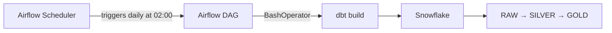
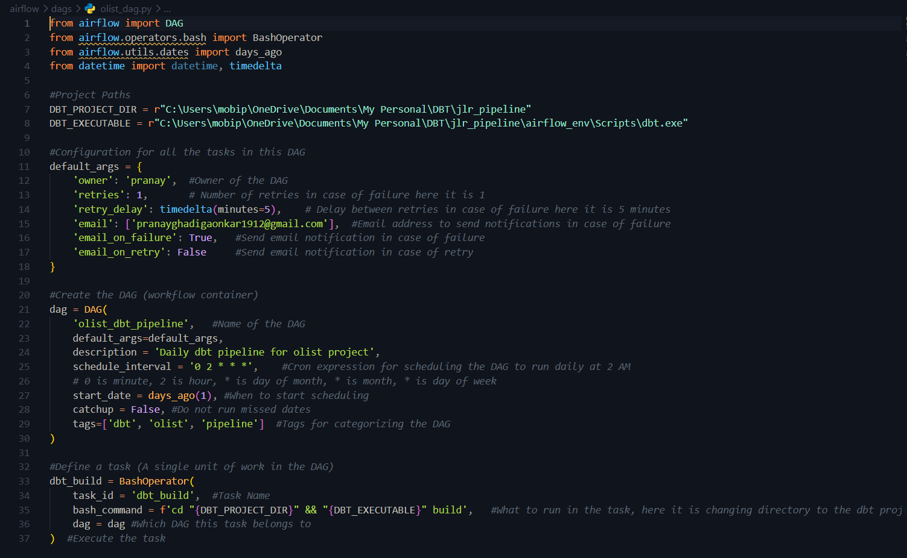

# Olist E-Commerce dbt Pipeline (Airflow Orchestration)

> ⚠️ This branch (`airflow-orchestration`) adds **Airflow orchestration** on top of the Snowflake pipeline.
> For the DuckDB version, see the [`main`](../../tree/main) branch.
> For the Snowflake version, see the [`snowflake-migration`](../../tree/snowflake-migration) branch.

## Overview
This branch extends the Olist dbt pipeline with an **Airflow DAG** that schedules and orchestrates the daily `dbt build` on Snowflake. It demonstrates workflow orchestration, dependency management, retry logic, and alerting — the layer that turns a pipeline into a production job.

A production-style ELT pipeline on 100k+ real e-commerce orders — medallion architecture, 92 passing data tests, and Airflow orchestration layered on top of DuckDB and Snowflake warehouses.

> ℹ️ The DAG is **structurally complete and ready to run**. Airflow does not support Windows natively, so it requires a Linux runtime (WSL2, Docker, or Databricks). See [Why this DAG isn't running yet](#why-this-dag-isnt-running-yet) below.

## Architecture


```mermaid
flowchart LR
    A[Airflow Scheduler] -->|triggers daily at 02:00| B[Airflow DAG]
    B -->|BashOperator| C[dbt build]
    C --> D[Snowflake]
    D --> E[RAW → SILVER → GOLD]
```

**Flow:**
1. Airflow scheduler fires the DAG on a cron schedule (`0 2 * * *`)
2. The DAG runs a single `BashOperator` task that executes `dbt build`
3. dbt seeds, transforms, and tests all models against Snowflake
4. Failures trigger email alerts; retries happen automatically

## DAG Structure

| Property | Value |
|---|---|
| DAG ID | `olist_dbt_pipeline` |
| Schedule | `0 2 * * *` (daily at 02:00) |
| Catchup | `False` (no backfills) |
| Retries | 1 |
| Retry delay | 5 minutes |
| Alerting | Email on failure |
| Tags | `dbt`, `olist`, `snowflake` |
| Task | `dbt_build` (BashOperator) |

## DAG Code

The complete DAG lives in [`airflow/dags/olist_dag.py`](./airflow/dags/olist_dag.py).



**Key design choices:**

- **Single BashOperator task** — the whole `dbt build` runs as one atomic task. This is appropriate here because dbt already handles its own DAG-level dependency ordering internally. Airflow doesn't need to see inside it.
- **Email on failure, not on retry** — a failing task should alert immediately, but a retry succeeding shouldn't spam the inbox.
- **`catchup=False`** — a missed daily run shouldn't backfill. Just run the next scheduled one.
- **`days_ago(1)` start date** — prevents Airflow from trying to schedule historical runs from a fixed start date.

## Why This DAG Isn't Running Yet

Airflow is **POSIX-only**. It uses `os.register_at_fork()` for internal bookkeeping, which does not exist on Windows. This is not a configuration issue — it's a fundamental platform limitation.

Running `airflow` on Windows produces:

```
AttributeError: module 'os' has no attribute 'register_at_fork'

Note: Airflow currently can be run on POSIX-compliant Operating Systems.
On Windows you can run it via WSL2 or via Linux Containers.
```

**Decision made:** Rather than force an unsupported workaround, the DAG will run on a **Linux runtime** — either WSL2 locally, or Databricks for the next project. The DAG code itself is complete and portable; only the execution environment needs to change.

This is a real engineering trade-off: **knowing when to stop fighting a tool and use it on its intended platform.**

## Project Structure

This branch shares the Snowflake project structure (models, macros, seeds) and adds:

```
airflow/
├── dags/
│   └── olist_dag.py            # the orchestration DAG
├── logs/                       # Airflow runtime logs (gitignored)
├── plugins/                    # custom plugins (empty)
└── airflow.cfg                 # Airflow config (gitignored)

docs/
└── airflow_dag_code.png        # DAG screenshot

macros/
├── generate_schema_name.sql    # inherited from snowflake-migration
└── backup_table.sql            # inherited from snowflake-migration
```

## Data Quality

Inherited from the Snowflake branch:

- **92 data tests** across all layers — all passing
- **121 total dbt nodes** built successfully in a single `dbt build` (9 seeds + 9 staging views + 11 tables + 92 tests)
- Custom singular tests for business logic validation
- Pre-hook `backup_table()` on every silver and gold model

See the [`snowflake-migration`](../../tree/snowflake-migration) branch for the full pipeline documentation.

## How to Run (on a Linux Runtime)

Once you're on WSL2, Docker, or Databricks:

```bash
# 1. Install Airflow in a Linux environment
pip install apache-airflow

# 2. Point Airflow at this repo's airflow/ folder
export AIRFLOW_HOME=$(pwd)/airflow

# 3. Initialize the metadata database
airflow db init

# 4. Verify the DAG is discoverable
airflow dags list | grep olist

# 5. Trigger a manual run
airflow dags test olist_dbt_pipeline $(date +%Y-%m-%d)
```

Then start the scheduler and webserver:

```bash
airflow scheduler &
airflow webserver --port 8080
```

## 🔀 Branches

| Branch | Warehouse | Status |
|---|---|---|
| `main` | DuckDB | ✅ Complete |
| `snowflake-migration` | Snowflake | ✅ Complete |
| `airflow-orchestration` | Snowflake + Airflow | ⚠️ DAG ready (Windows blocked) |

## 📈 Results

**Airflow DAG — orchestration code:**


## Status
🚧 DAG ready — pending Linux runtime

### Completed
- ✅ Airflow DAG written (`airflow/dags/olist_dag.py`)
- ✅ Daily schedule configured (`0 2 * * *`)
- ✅ Retry logic (1 retry, 5-minute delay)
- ✅ Email alerting on failure
- ✅ Task tagged for filtering (`dbt`, `olist`, `snowflake`)
- ✅ DAG committed and version-controlled
- ✅ Windows limitation documented with root-cause explanation

### Next Steps
- 🔜 Run the DAG on WSL2 to validate end-to-end
- 🔜 Add task-level callbacks for Slack/email routing
- 🔜 Migrate orchestration to Databricks Workflows (next project)